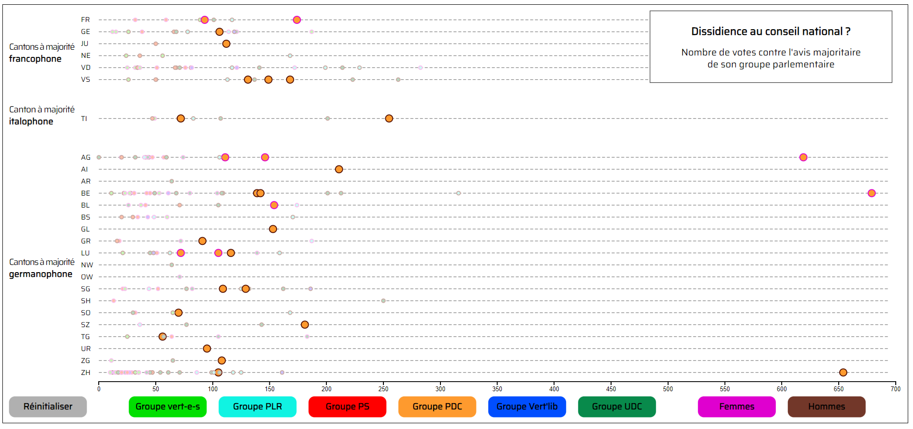

# Votes dissidents au conseil national
Visualisation des votes "dissidents" des conseillers nationaux par rapport à leur groupe parlementaire. Les données sont constituées des treize premières sessions parlementaires de la 51ème législature ( 2 décembre 2019 - 18 mars 2022). La visualisation interactive est disponible [ici](https://theor98.github.io/).

## Description
Qui sont les parlementaires qui votent le plus souvent différemment de leur groupe parlementaire ? Certains partis sont-ils plus disciplinés que d'autres ? Les conseillères nationales sont-elles plus dissidentes car minoritaires ? De même pour les élus de langue maternelle française ou italienne ? Tant de questions auxquelles tente de répondre cette visualisation, via la représentation graphique de l'ensemble des conseillers nationaux en fonction du nombre de fois où ils ont voté différemment de l'avis majoritaire de leur groupe parlementaire. Pour rendre plus lisibles les données, la visualisation possède des filtres pour chaque groupe parlementaire et par genre. Lors du survol d'un cercle, une infobulle se déploie pour permettre d'identifier chaque parlementaire. 

## Données
### Acquisition des données
Les votes des conseillers nationaux sont en libre téléchargement en format XLS sur le site du [parlement suisse](https://www.parlament.ch/fr/ratsbetrieb/abstimmungen/abstimmung-nr-xls).

### Traitement des données
La première étape a été de compter pour chaque groupe parlementaire et pour chaque votation, le nombre de voix exprimées en faveur du texte, en sa défaveur et le nombre d'abstention. Il a fallu ensuite déterminer quel sous-groupe _(Oui / Non / Abstention)_ a recueilli le plus grand nombre de voix au sein de chaque groupe parlementaire afin de pouvoir déduire les personnes ayant exprimé une divergence. La dernière étape a été de dégager l'existence ou non d'une "consigne de vote" (cf. [méthodologie](#Méthodologie)) pour ensuite créer la liste des personnes s'étant exprimées contre celle-ci. 
Pour plus d'informations, les résultats de l'analyse pour la [13ème session parlementaire](5113_prêt.xlsb.xlsx) sont disponible en guise d'exemple.

### Quelques nombres 
| Éléments | Nombre |
|:--------:|:------:|
|Sessions parlementaires comptabilisées |13     |
|Conseillers nationaux de la 51ème législature|207     |
|Votations à l'intérieur du conseil national|3'609     |
|Toal des votes dissidents comptabilisés    |18'202      |

## Méthodologie
### Détermination de l'existence ou de l'absence d'un avis majoritaire 
Dans l'optique de comptabiliser uniquement les personnes ayant votés différemment de la consigne de vote ou _a minima_ différemment de l'avis majoritaire du groupe parlementaire auquel ils appartiennent, il était nécessaire de définir un seuil en dessous duquel les voix étaient trop dispersées pour considérer qu'un avis majoritaire existait. Pour chaque vote est donc calculé un taux de dispersion des voix : il s'agit du nombre de votes exprimés dans le sens majoritaire par rapport au nombre de votes exprimés total. Si ce taux de dispersion était supérieur à 34% j'ai alors considéré qu'il n'y avait aucun avis majoritaire au sein d'un groupe parlementaire et que les voix divergentes ne seraient pas comptabilisées.

### Coefficient de participation
Tous les membres du conseil national ne votent pas autant de fois durant un mandat. Il arrive que des conseillers nationaux quittent le parlement en cours de législature auquel cas ils sont remplacés, généralement dès la session parlementaire suivante. A cela s'ajoute l'existence d'une présidence tournante du conseil national qui empêche la personne en poste de voter. Afin de mettre les parlementaires sur un pied d'égalité, le nombre de votes dissidents a été multiplié par un "coefficient de participation" calculé comme suit : le nombre total de votations (3609) divisé par le nombre d'occasion qu'a eu chaque parlementaire pour voter. Les absences, qu'elles soient justifiées ou non, ne rentrent pas dans le calcul de ce coefficient. Pour les détails voir [CSV final](51_csv_final.csv).

### Limites
Quelques limites du projet un peu en vrac :
  - S'abstenir ou voter l'inverse de son parti n'ont pas la même signification en politique mais sont comptabilisés de manière identique dans le projet.
  - La visualisation est un peu concentrée à cause des valeurs extrêmes des trois membres du parti évangélique suisse qui font partie du groupe M-E (le groupe du PDC). Les autres membres de "petits partis" à l'intérieur des groupes parlementaires n'ont toutefois pas automatiquement des nombres de votes dissidents extrêmes. 
  - La détermination de l'existence d'un avis majoritaire est arbitraire. J'ai choisi 66% après avoir consulté mon entourage et des politiciens locaux mais un autre seuil aurait été envisageable. 

## Procédure d'installation
1. Installer [Visual Studio Code](https://code.visualstudio.com/) et l'extension Live Server.
2. Télécharger les fichiers [index.html](index.html), [script.js](script.js), [style.css](style.css) et [51_csv_final.csv](Données/51_csv_final.csv).
3. Ouvrir ces fichiers dans Visual Studio Code.
4. Ouvrir "index.html" dans un navigateur Internet via le bouton _go live_.

## Outils utilisés

Le traitement des données s'est fait via Excel et la visualisation a été réalisée en utilisant la librairie [d3.js](https://d3js.org/).

## Contexte du projet
Ce projet a été réalisé par Théo Rochat dans le cadre du cours de _Visualisation de données (SP22)_ donné par Isaac Pante à l'Université de Lausanne.
